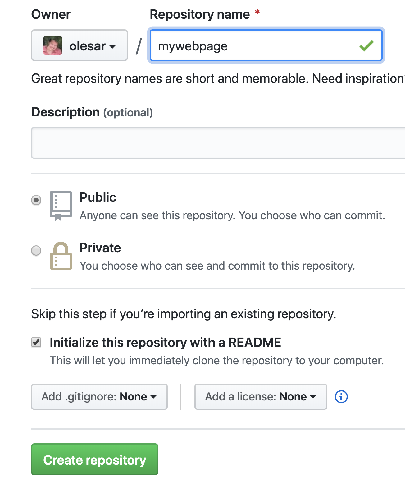

### GitHub   
На занятиях по Python вы научитесь полноценно пользоваться GitHub как системой контроля версий. Для сдачи домашних заданий достаточно, чтобы вы  

* завели аккаунт на GitHub  

* создали там репозиторий  

* загрузили файлы в репозиторий  

Все эти действия можно делать непосредственно с помощью браузера, особенно если вы не знаете волшебных слов `add`, `commit`, `push`.

Вот несколько ключевых скриншотов:  
1. На странице [github.com](https://github.com/) нажмите Sing Up, укажите имя аккаунта, подтвердите его по электронной почте.

2. Вам предложат создать новый репозиторий:

Если так не получилось, зайдите на основную страницу своего гитхаба (например, моя - https://github.com/olesar, где olesar - название моего аккаунта) и нажмите кнопку New на вкладке Repositories

3. Укажите имя репозитория, тип (Public) и добавьте файл README.

4. Зайдите в созданный репозиторий и загружайте файлы с помощью кнопки `Upload files`...

5. Чтобы создать папку внутри репозитория, нажмите `Create file` и создайте файл с именем `newfolder/readme.txt`, где `newfolder` - имя вашей папки. Файл readme можно оставить пустым, а можно написать туда комментарий. Нажмите на кнопку `Commit new file` внизу страницы.

